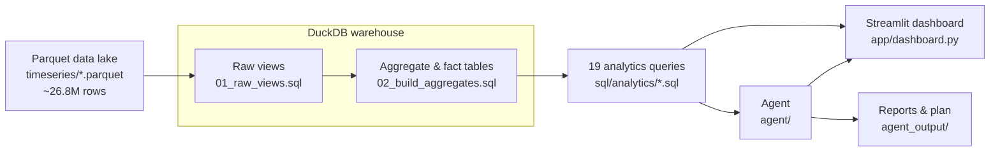
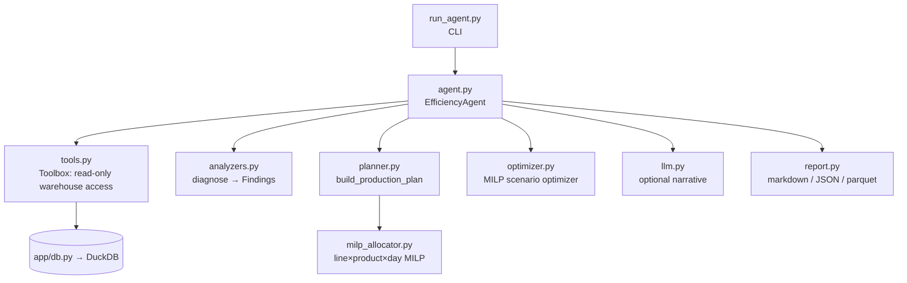

# 02 — Architecture

## End-to-end data flow

The build step (`scripts/init_db.py`) runs the two foundation SQL scripts once to
create `coffee_bi.duckdb`. Everything downstream reads from that warehouse.

## Layered design

| Layer | Files | Responsibility |
|-------|-------|----------------|
| **Config** | [config.py](../config.py) | Paths, business assumptions, agent/optimizer parameters, SQL placeholder substitutions |
| **Data lake** | `../coffee_capsule_dataset/` (external) | Raw Parquet sensor data (not in this repo) |
| **Warehouse build** | [sql/01_raw_views.sql](../sql/01_raw_views.sql), [sql/02_build_aggregates.sql](../sql/02_build_aggregates.sql), [scripts/init_db.py](../scripts/init_db.py) | Views over Parquet + materialised aggregates/facts |
| **Analytics** | [sql/analytics/](../sql/analytics/) (19 files) | Self-documenting complex KPI queries |
| **Access layer** | [app/db.py](../app/db.py) | Connect, substitute placeholders, discover & run queries |
| **UI** | [app/dashboard.py](../app/dashboard.py) | Interactive Streamlit + Plotly dashboard |
| **Agent** | [agent/](../agent/) | Tools, diagnosis, planning, optimization, narration, reporting |

## Agent internal architecture

The agent follows an explicit **plan → act → observe** loop and records a
transparent trace of every step (visible in the report and the dashboard's
Agent tab). When LLM credentials are present it adds an executive narrative;
otherwise it uses a deterministic template — the numeric results are identical
either way, because the deterministic engine is always the source of truth.

## Determinism guarantees

Both MILP solves ([agent/milp_allocator.py](../agent/milp_allocator.py) and
[agent/optimizer.py](../agent/optimizer.py)) are made bit-for-bit reproducible by:
sorting all lines/products/days before building variables, pinning CBC to a
single thread, fixing the CBC random seed, and solving to a tight optimality gap.
This means the same inputs always produce the same schedule.

Next: [03 — Getting Started](03-Getting-Started.md).
