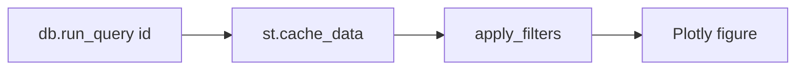

# 06 — Dashboard

The dashboard is a single **Streamlit + Plotly** app:
[app/dashboard.py](../app/dashboard.py). It reads exclusively from the DuckDB
warehouse through [app/db.py](../app/db.py) and caches every query with
`@st.cache_data` so interaction stays snappy.

## Launch

```powershell
streamlit run app/dashboard.py
```

If the warehouse is missing, the app shows an error and tells you to run
`python scripts/init_db.py` first.

## Sidebar filters

- **Production line** — multiselect over L1/L2/L3.
- **Date range** — bounded by the actual min/max day in the data.
- **Product** — STRONG / MILD / DECAF.

Filters are applied by `apply_filters()`, which transparently finds the relevant
line/date/product columns on whatever DataFrame it's given.

## Header KPIs

A row of metric cards driven by query **01 — Plant KPI Summary**: OEE,
Availability, Performance, Quality, plus totals for output, energy and downtime.

## Tabs

| Tab | Content |
|-----|---------|
| **Overview** | Rolling 7-day OEE trend, state-utilization stack, hour × weekday heatmap |
| **OEE & Performance** | Line/machine OEE, availability/performance/quality breakdown, bottlenecks |
| **Reliability & Downtime** | Downtime Pareto (with cumulative %), MTBF vs MTTR |
| **Quality & Output** | Output by product, yield, worst offenders, changeover matrix |
| **Energy & Cost** | Daily cost, kWh per 1,000 capsules, energy by product |
| **Predictive Maintenance** | Risk ranking, vibration exceedance, degradation↔reject correlation, temperature anomalies, maintenance schedule |
| **Machine Explorer** | Full machine master data |
| **SQL Explorer** | Run any saved query or your own SQL, download CSV |
| **🤖 Agent** | Run the efficiency & production-planning agent; view diagnosis, plan, schedule, reasoning trace, and the MILP scenario optimizer (Pareto scatter + frontier table) |

## How data reaches the charts



Each chart calls the cached `q("<query_id>")` helper, applies the sidebar
filters, and renders a Plotly figure. Because query discovery is automatic, new
`.sql` files show up in the SQL Explorer without code changes.

Next: [07 — The Agent](07-Agent.md).
