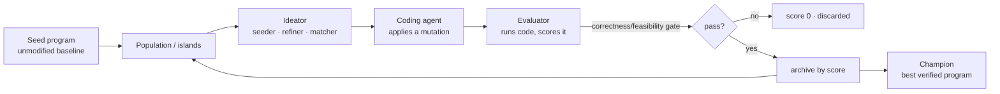

# 15 — How Darwin Produced These Results

This page explains the **method** behind the four Darwin experiments documented in
this wiki:

- [11 — Token Optimization](11-Darwin-Token-Optimization.md) — narration prompt −88.1%
- [12 — Warehouse Build Speedup](12-Darwin-Warehouse-Build-Speedup.md) — build 3.10× faster
- [13 — Optimizer Margin Gain](13-Darwin-Optimizer-Margin-Gain.md) — margin +0.19%, still feasible
- [14 — Planner Fulfilment](14-Darwin-Planner-Fulfilment.md) — fulfilment 98.24% → 100%

They target very different parts of the codebase (LLM prompt, SQL build, two
MILPs), yet all four were produced by the **same evolutionary loop**. Understanding
that loop explains why the numbers are trustworthy rather than cherry-picked.

## What Darwin is

Darwin is an **evolutionary coding agent**. Instead of asking a model to rewrite a
file once, it runs a search: it repeatedly mutates the code, *measures* each
variant against an objective, and keeps the ones that score better — evolving a
population of programs over many iterations. Nothing is accepted on a model's
say-so; every candidate has to earn its place by beating a benchmark.

## The four ingredients

### 1. A seed program

Every run starts from the **pristine, unmodified baseline** of the repo (iteration
0 in each lineage table). This is the reference the improvement is measured
against, so the reported deltas are always "champion vs. the real starting code."

### 2. An evaluator that returns a number

Each experiment defines an evaluator that runs the candidate and computes a
**fitness score** plus a hard **gate**. This is where the objective lives — Darwin
only ever optimises what the evaluator measures:

| Experiment | Fitness (higher is better) | Hard gate (fail → score 0) |
|---|---|---|
| Token opt. (11) | fewer narration prompt tokens | canonical result hash unchanged |
| Build speedup (12) | `baseline_time / candidate_time` | 5 aggregate/fact tables byte-identical |
| Margin (13) | `gross_margin_eur` ratio | solver Optimal + feasible (≤ demand, ≤ capacity, uplift ≤ 15%) |
| Fulfilment (14) | fulfilment − changeover penalty | feasible (no overproduction, maintenance intact) |

### 3. An ideator (seeder → refiner → matcher)

Rather than mutating blindly, Darwin proposes *ideas* and pairs them with
programs:

- **Seeder** — generates an initial backlog of candidate optimisations.
- **Refiner** — distills evidence into new, ranked ideas. In the build-speedup run
  this meant reading each statement's `EXPLAIN ANALYZE` profile and turning the
  hotspot into a concrete idea (e.g. "attack `agg_machine_hour`'s HASH_GROUP_BY").
- **Matcher** — decides which idea to try on which program next.

The ideas are visible in the lineage tables — e.g. idea **#124** ("always
re-profile before optimizing, because the bottleneck moves") drove the three
biggest jumps in the build-speedup run.

### 4. Island / MAP-Elites population search

Candidates are kept in an **archive of islands** (a MAP-Elites style population),
not a single line of descent. This preserves diversity — several partial solutions
evolve in parallel — so the search can combine independent wins. The token run is
the clearest example: the **plan compaction** (−75.6%) and the **findings
compaction** (−88.1% total) were two separate structural discoveries that
**compound**, found on island 2's lineage.

## Why the improvements are real (not gamed)

The single most important design choice is that **the gate cannot be talked
past** — it is executed code, not a judgement. This shows up concretely in each run:

- **Correctness is re-derived from the candidate's own output.** The build-speedup
  evaluator fingerprints the produced tables (row counts, rounded column sums,
  distinct-key counts, date ranges) and requires a match; every accepted program
  has `results_identical = 1.0`.
- **Feasibility gates block the tempting cheat.** In the margin run, the "easy"
  route to a bigger number is to relax the demand cap — which the evaluator scores
  **0**. Every accepted program is `feasible = 1.0`, so the +0.19% is
  constraint-respecting profit, not a bypass.
- **Anti-cache / cold measurement.** The build-speedup run wipes stray `*.duckdb`
  artifacts and uses a fresh `TMPDIR` per build, so a "speedup" can't come from
  reusing a prebuilt warehouse.
- **The metric is measured where it's defined.** The token run's iter-2 dead end
  compacted serialisation *inside* `narrate()`, which the token metric (measured on
  the payload *before* `narrate()`) can't see — so it scored 0% and the search
  moved on to structural changes that actually reduce the measured payload.

## Why some gains are large and others tiny — both are correct

- **Large gains come from replacing a heuristic.** The planner (14) went from a
  demand-blind round-robin rest day to a real MILP → +1.76 pp to a perfect 100%.
  The build (12) went 3.10× because a one-shot bulk load had obvious untapped
  parallelism and profiling slack.
- **Tiny gains come from an already-optimal baseline.** The optimizer (13) is
  *already a solved MILP*, so legitimate headroom is a fraction of a percent by
  construction. A large "win" there would be a red flag (almost certainly an
  infeasibility). Darwin returning **+0.19% and feasible** is exactly the honest
  result — and it's a textbook OR move (tighten the LP relaxation, spend the solver
  budget on the solve that sets the score).

## Verifying the headline number after the run

For timing especially, the in-run score is **noisy** because Darwin re-samples the
baseline inside every evaluation. The build-speedup run made this explicit: the
top-*scored* in-run program (iter 55, "3.45×") actually had a *slower* build than
the champion — it just landed on a slow baseline sample. The honest figure came
from a **controlled re-measurement**: 10 interleaved paired cold builds, a
bootstrap 95% CI of **[3.08×, 3.12×]**, and a Welch's t-test at p ≈ 10⁻²². The
lesson baked into the report: **verify timing benchmarks before quoting them.**

## Summary

| Experiment | Baseline kind | Result | Gate that kept it honest |
|---|---|---|---|
| 11 Token | full-fidelity serialization | −88.1% prompt tokens | canonical hash byte-identical |
| 12 Build | 4-thread one-shot load | 3.10× faster (CI ±0.02) | tables byte-identical + cold, anti-cache |
| 13 Margin | already-optimal MILP | +0.19% margin | Optimal + feasible |
| 14 Fulfilment | greedy round-robin planner | 98.24% → 100% | feasible, maintenance intact |

Across all four, the pattern is identical: **a seed, an executable objective, a
hard correctness/feasibility gate, and an evolutionary population search steered by
an evidence-driven ideator.** The numbers are trustworthy precisely because Darwin
optimises only what the evaluator can measure — and the evaluator refuses to score
anything that breaks correctness or feasibility.
